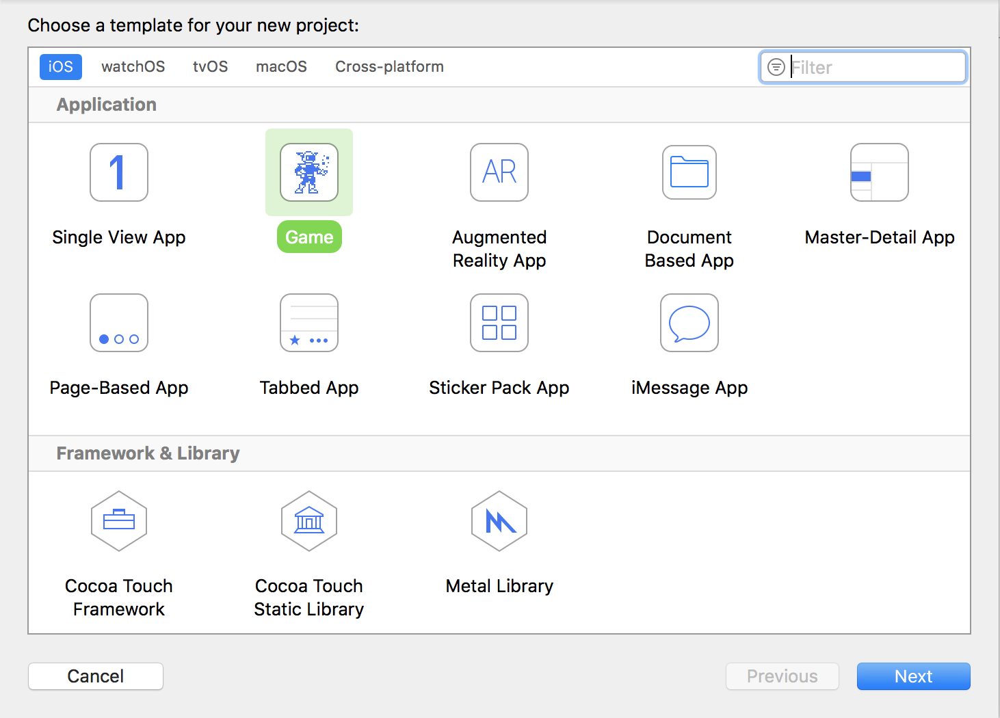
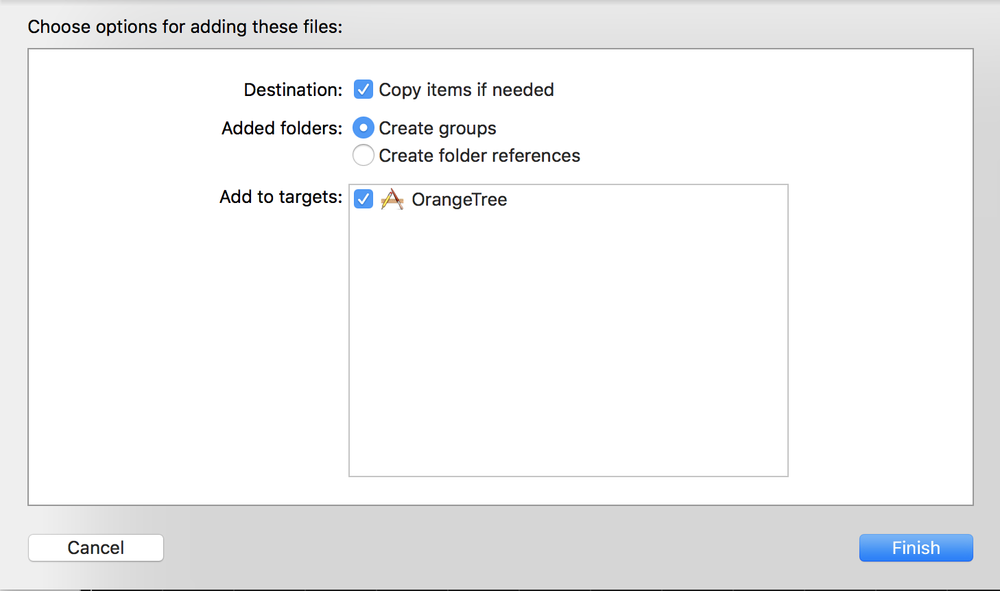
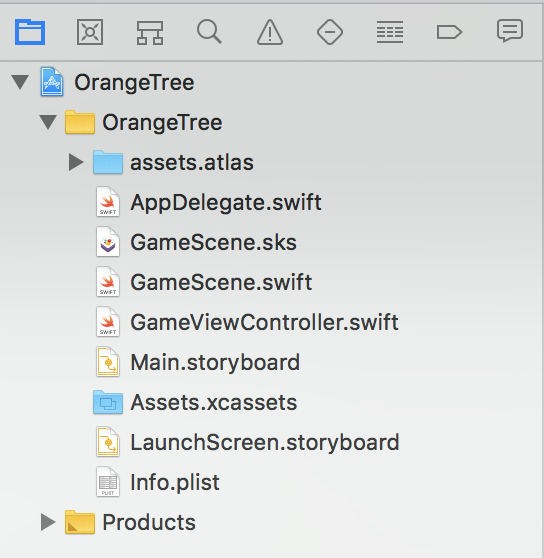

## Create a New Xcode Project

> [action]
> Create a new *Game* project in Xcode named `OrangeTree` and check that the *Language* is set to `Swift` and
> *Game Technology* is set to `SpriteKit`.
> 
>
> 

## Import Resources for Project

> [action]
> Download the [Orange Tree assets](https://github.com/MakeSchool-Tutorials/Orange-Tree-SpriteKit-Swift4/raw/master/assets.atlas.zip)
> that have been created for you.
> Once the download has finished, unpack the zip file and drag it into the project tree on the lefthand side.
> Make sure that you have *Copy items if needed* and *Create Groups* selected.
> 
> When you have finished, your project tree on the left should look like this.
> 

# Summary

Awesome! Now that we have our project set up and our assets in place, we can start working on our Angry Birds clone.
before we move on though, let's build our porject to make sure everything is setup okay so far. Use `CMD+B` to build the project
wihtout running it. If your project finished building with no errors you are ready to move on to the next section!
