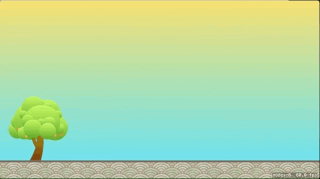

In this section you are going to create the flying oranges that will be fired from
the tree. By the end, you will have a system in place to fling oranges around the
screen!

# Code Cleanup

Before you begin adding the orange, you need to do a little cleanup of auto generated
code. When you create a new SpriteKit project, Apple puts some code into the files that
you don't need, but is great for seeing how some basic actions work.

> [action]
> Start by opening *GameScene.swift* and replacing everything in the file with the following.
>
```
import SpriteKit
>
class GameScene: SKScene {
>
}
```
>

You will be adding more to this file a little bit later on.

> [action]
> Next open *GameViewController.swift* and find this line:
> `if let scene = SKScene(fileNamed: "GameScene") {` and change it to
> `if let scene = GameScene(fileNamed: "GameScene") {`

Now the *GameViewController* will load the *GameScene* class defined in `GameScene.swift`
with *GameScene.sks*.

# Adding the Orange

With that little bit of cleanup out of the way, you can now create the Orange! The Orange
will be created using code, in a custom class called *Orange*.

> [action]
> Create a new file using the `CMD+N` shortcut. Select *Swift File* and hit *Next*.
> Name the file `Orange` and hit *Create*. Remove the line `import Foundation` and add
> the following to the file.
>
```
import SpriteKit
>
class Orange: SKSpriteNode {
  init() {
    let texture = SKTexture(imageNamed: "Orange")
    let size = texture.size()
    let color = UIColor.clear
 >   
    super.init(texture: texture, color: color, size: size)
 >   
    physicsBody = SKPhysicsBody(circleOfRadius: size.width / 2)
  }
 >
  required init?(coder aDecoder: NSCoder) {
    fatalError("init(coder:) has not been implemented")
  }
}
```
>

The above code is creating a custom *SKSpriteNode* class. You have called that class
*Orange*. You have also created a custom initializer method that gives more control
over how to create these nodes in the scene. 

The first three line should be pretty straightforward, you want to set the *texture*
and *size* to that of the *Orange.png* image. You then set the *color* to clear because
the image is already colored and you don't want to override that by applying color on
top of the image.

Next, you call the `super.init()` method and pass in the three properties you created.
The line that sets the physics body may seem a little weird. Remember how in the 
*GameScene.sks* file you added a physics definiton to the *ground* node? In the scene file
you are able to use the *Attributes Inspector* to choose options and set them. In the code, 
when you want to define the physics, you have to create the physics body first.

> [challenge]
> Can you guess what this line of code is doing? `SKPhysicsBody(circleOfRadius: size.width / 2)`

<!-- -->

> [solution]
> If you guessed that it was creating a circular physics body that fits the outline of the
> orange, then you guessed right! When you create an *SKPhysicsBody* using the *circleOfRadius*
> initializer you are telling *SpriteKit* to make a physics body that is circular, and has a 
> radius of the specified size. If you remember from Geometry, the *radius* of a circle is the
> length from the center point straight out to the outer edge. That is why you pass in half of
> the width of the texture.

Alright, ready to fire some oranges?

# Fire Away!

Lets add some code to fire those oranges!

> [action]
> Open *GameScene.swift* and add these two lines to the top of the class
>
```
var orangeTree: SKSpriteNode!
var orange: Orange?
```
>

Do you remember how to initialzie game objects in the scene? Think back to the Sushi Neko
tutorial and give this next challenge a shot!

> [challenge]
> Connect the `orangeTree` property in *GameScene.swift* to the *tree* node you created in the
> previous section.

<!-- -->

> [solution]
> First, you need to add the `didMove(to view: SKView)` function to the *GameScene* class.
> Next, you set the `orangeTree` property equal to the child node named `tree`.
>
```
override func didMove(to view: SKView) {
  // Connect Game Objects
  orangeTree = childNode(withName: "tree") as! SKSpriteNode
}
```
>
> Remeber if you start typing `didMove` Xcode will give you the auto completion to override
> the method. Always use these when you can as they help to avoid making mistakes in typing out
> the parameter names and types.

Next, you are going to add the code to wire up the touches, that way when you tap on the tree,
you can fling those oranges!

> [action]
> Below the `didMove(to view:)` function, add the following. Remember to use the auto complete
> to add the `touchesBegan` function!
>
```
override func touchesBegan(_ touches: Set<UITouch>, with event: UIEvent?) {
  // Get the location of the touch on the screen
  let touch = touches.first!
  let location = touch.location(in: self)
> 
  // Check if the touch was on the Orange Tree
  if atPoint(location).name == "tree" {
    // Create the orange and add it to the scene at the touch location
    orange = Orange()
    orange?.position = location
    addChild(orange!)
>  
    // Give the orange an impulse to make it fly!
    let vector = CGVector(dx: 100, dy: 0)
    orange?.physicsBody?.applyImpulse(vector)
  }
}
```
>

Now the moment you have been waiting for! Go ahead and run the game and fling those oranges!



That was exciting! With not too much work you were able to make some citrus fly. Unfortunately,
the oranges fly in the same direction every time :/. If you want to make it so you can aim
where the oranges will fly, you need to go back and refactor some code.

> [info]
> The process of building out a feature and then going back to refactor and refine it is very
> common when developing software. You will be doing this many times as you learn and create new
> projects. The key takeaway here is don't get so attached to your code that you are afraid to
> go back and make it better!

# Improving the Trajectory

If you want to have a firing mechnaism that works similar to how Angry Birds works, you are
going to need a way to aim those oranges. One way you can handle this is to create the Orange
when the user taps, and then allow them to drag their finger. As the touch moves, it will create
a vector to fire the Orange!

That may sound a little complicated, and it may not even make sense at the moment. Don't panic!
Let's dive in and see how easy it is!

> [action]
> To start, you are going to need a property to store where the touch began. It will be used to
> create the launch vector. Inside of *GameScene.swift*, underneath the previous properties, add
> a new property called *touchStart* and initialize it as an empty *CGPoint*.
>
```
var touchStart: CGPoint = .zero
```
>

Awesome, now you have a property to store where the touch began. You are able to leave off the
`CGPoint` before the `.zero`, because Xcode knows that it already has the type of `CGPoint`.
This works because you already declared the type. Pretty neat trick huh? Plus, it looks much
better than `var touchStart: CGPoint = CGPoint.zero`. That is a bit redundant don't you think?

Time to revamp the *touchesBegan* method!

> [action]
> Take a look at the code below and make sure that you match your code to it.
>
```
override func touchesBegan(_ touches: Set<UITouch>, with event: UIEvent?) {
  // Get the location of the touch on the screen
  let touch = touches.first!
  let location = touch.location(in: self)
>
  // Check if the touch was on the Orange Tree
  if atPoint(location).name == "tree" {
    // Create the orange and add it to the scene at the touch location
    orange = Orange()
    orange?.physicsBody?.isDynamic = false
    orange?.position = location
    addChild(orange!)
>
    // Store the location of the touch
    touchStart = location
  }
}
```
>

The main highlights from this change are that you removed the code that gives the Orange an 
impulse and you set the *physicsBody* dynamic property to `false`. Setting this to false makes
sure that the Orange does not get effected by gravity or interact with any objects until you
are ready to make it fly. Also note that you are storing the location of the touch for later.

Next, you are going to add the *touchesMoved* function. This function is called when a touch
is dragged across the screen by a user's finger.

> [action]
> Add the following code below the *touchesBegan* function in the *GameScene* class.
>
```
override func touchesMoved(_ touches: Set<UITouch>, with event: UIEvent?) {
  // Get the location of the touch
  let touch = touches.first!
  let location = touch.location(in: self)
>
  // Update the position of the Orange to the current location
  orange?.position = location
}
```
>

The comments should make it pretty clear what is going on here. First you need to get the location
of the touch (where it moved to). Next, you need to update the position of the Orange to the 
current location of the user's finger. This is what allows you to drag the Orange back.

Now when the user stops moving their finger and lets go, the orange should go flying. Let's put that
code in now.

> [action]
> Beneath the code you just added for *touchesMoved* add the *touchesEnded* function with the 
> code below.
>
```
override func touchesEnded(_ touches: Set<UITouch>, with event: UIEvent?) {
  // Get the location of where the touch ended
  let touch = touches.first!
  let location = touch.location(in: self)
>
  // Get the difference between the start and end point as a vector
  let dx = touchStart.x - location.x
  let dy = touchStart.y - location.y
  let vector = CGVector(dx: dx, dy: dy)
>
  // Set the Orange dynamic again and apply the vector as an impulse
  orange?.physicsBody?.isDynamic = true
  orange?.physicsBody?.applyImpulse(vector)
}
```
>

The comments should make it pretty clear what is going on, but let's recap it. First, you need to
grab the location of where the touch ended. Next, you want to get the difference between the start
and ending locations. Once you have that difference, you want to reactive the *isDynamic* property
by setting it to `true`. Now that the Orange can interact with physics again, you want to apply
the vector you created as an impulse to the Orange.

Go ahead and run the game and watch your citrus fly!

# Houston, We Have a Problem!

Awesome, those oranges really fly now huh! But there is a slight problem. It is really hard to tell
where those oranges are going to go. A great way to make this better would be to show the launch
vector! You can achieve this by drawing a line where the user dragged their finger.

> [action]
> The first step to drawing your line is to add an *SKShapeNode* to the scene. This is what you will
> use to hold the shape of your line and draw it on the scene. Add the following below the other
> properties at the top of your *GameScene* file.
>
```
var shapeNode = SKShapeNode()
```
>

*SKShapeNodes* are another node type built into *SpriteKit*. Using an *SKShapeNode* allows you to add
a path that will draw out a shape. On to drawing that launch vector!

> [action]
> Add the following code at the bottom of the *didMove(to view:)* method.
>
```
// Configure shapeNode
shapeNode.lineWidth = 20
shapeNode.lineCap = .round
shapeNode.strokeColor = UIColor(white: 1, alpha: 0.3)
addChild(shapeNode)
```
>
> Next you are going to add the code that will actually draw the line. Add the following code to
> the bottom of the *touchesMoved* function.
>
```
// Draw the firing vector
let path = UIBezierPath()
path.move(to: touchStart)
path.addLine(to: location)
shapeNode.path = path.cgPath
```
>
> The last thing you need to do is make sure that you remove the path from the *ShapeNode* when
> the touch ends. Add the following line to the end of the *touchesEnded* function.
>
```
// Remove the path from shapeNode
shapeNode.path = nil
```
>

Go ahead and run the game and check out that fancy new firing vector!

# Summary

Excellent job making it through all that! In this section you learned how to:

- Create a custom *SKSpriteNode* class
- Make *Sprites* interact with physics
- How to draw shapes with *SKShapeNodes*

In the next section you will be improving the scene by adding some destructible blocks!
